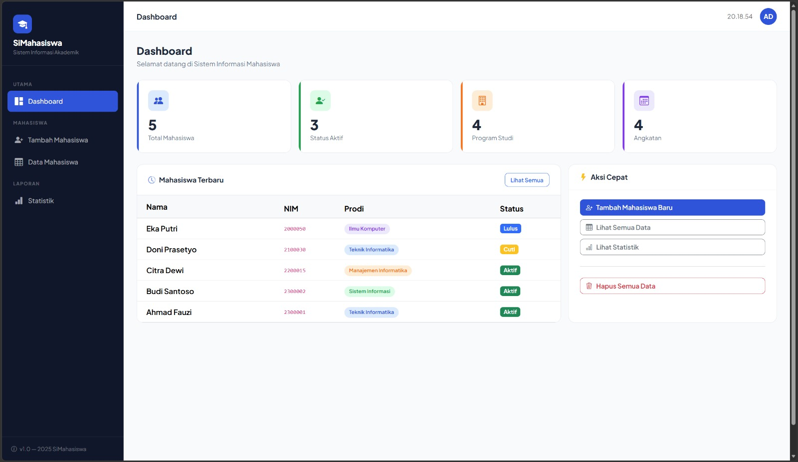
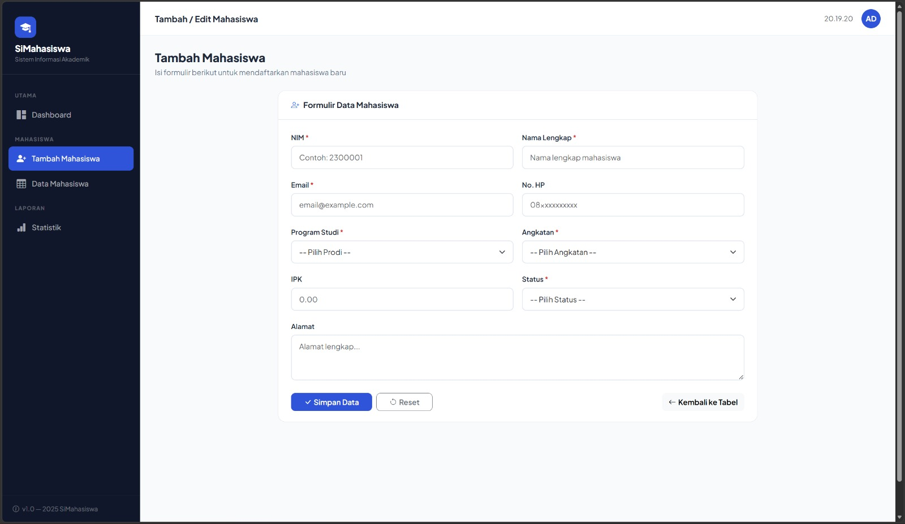
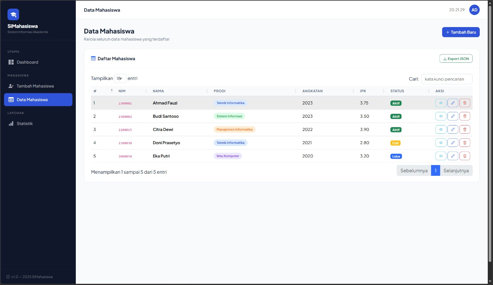
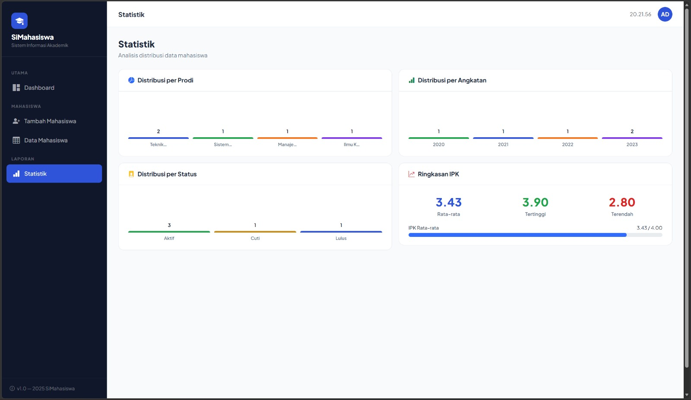
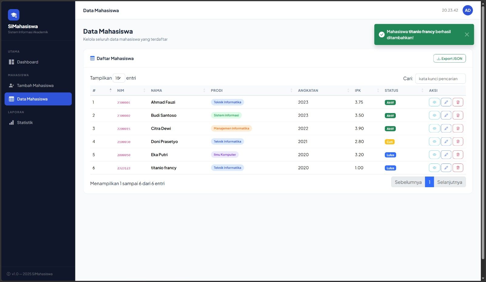
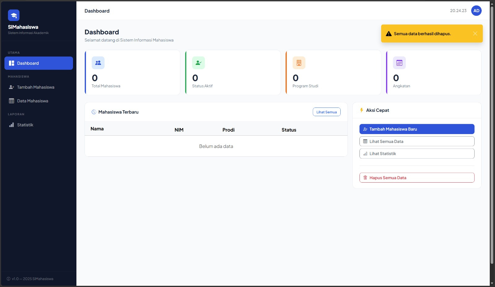
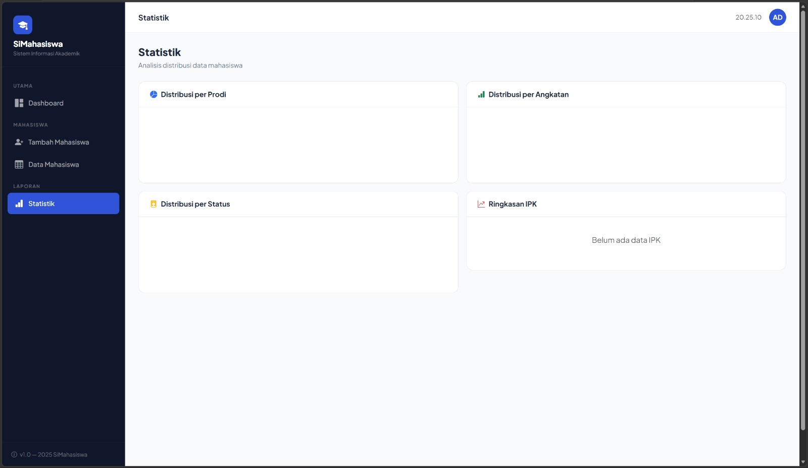

<div align="center">

# LAPORAN PRAKTIKUM  
# APLIKASI BERBASIS PLATFORM

## COTS 2

 

### Disusun Oleh
**[Titanio Francy Naddiansa]**  
[2311102289]  
[IF-11-04]  

### Dosen Pengampu
**Cahyo Prihantoro, S.Kom., M.Eng.**


### LABORATORIUM HIGH PERFORMANCE  
FAKULTAS INFORMATIKA  
UNIVERSITAS TELKOM PURWOKERTO  
2026

</div>

---

# Dasar Teori

## 1. Aplikasi Web

Aplikasi web adalah perangkat lunak yang diakses melalui browser internet tanpa perlu diinstal secara lokal pada perangkat pengguna. Berbeda dengan aplikasi desktop, aplikasi web berjalan di atas protokol HTTP/HTTPS dan terdiri dari dua sisi utama, yaitu sisi klien (*client-side*) yang berjalan di browser pengguna, dan sisi server (*server-side*) yang memproses logika bisnis dan berinteraksi dengan basis data. Komponen utama sebuah aplikasi web mencakup antarmuka pengguna (UI), logika aplikasi, dan lapisan penyimpanan data.

---

## 2. Framework Node.js + Express

Node.js adalah *runtime environment* JavaScript yang berjalan di sisi server, memungkinkan pengembang menggunakan JavaScript tidak hanya di browser, tetapi juga untuk membangun aplikasi backend. Node.js menggunakan model *event-driven* dan *non-blocking I/O* sehingga sangat efisien untuk aplikasi yang membutuhkan banyak koneksi secara bersamaan.

Express.js adalah framework web minimalis untuk Node.js yang menyediakan berbagai fitur untuk membangun aplikasi web dan REST API secara cepat dan terstruktur. Express mempermudah pengelolaan routing, middleware, dan response HTTP tanpa harus menulis kode dari nol.

Keunggulan Node.js + Express antara lain:
- **Performa tinggi** karena menggunakan arsitektur non-blocking.
- **Satu bahasa** (JavaScript) untuk frontend dan backend.
- **Ekosistem npm** yang sangat kaya dengan ribuan package siap pakai.
- **Mudah dikonfigurasi** dan fleksibel sesuai kebutuhan proyek.

---

## 3. Framework Bootstrap

Bootstrap adalah framework CSS front-end open-source yang dikembangkan oleh tim Twitter. Bootstrap menyediakan koleksi komponen UI siap pakai seperti navigasi, tombol, form, tabel, modal, dan sebagainya, yang dapat digunakan untuk membangun tampilan antarmuka web yang responsif dan konsisten di berbagai ukuran layar.

Bootstrap menerapkan sistem **grid 12 kolom** yang fleksibel sehingga tata letak halaman dapat menyesuaikan diri (*responsive*) terhadap perangkat desktop, tablet, maupun smartphone. Penggunaan Bootstrap secara signifikan mempercepat proses desain antarmuka tanpa harus menulis CSS dari nol.

---

## 4. CRUD (Create, Read, Update, Delete)

CRUD merupakan singkatan dari empat operasi dasar yang digunakan dalam pengelolaan data pada sebuah sistem informasi, yaitu:

- **Create** — Menambahkan data baru ke dalam basis data.
- **Read** — Membaca atau menampilkan data yang sudah tersimpan.
- **Update** — Memperbarui atau mengubah data yang sudah ada.
- **Delete** — Menghapus data dari basis data.

Keempat operasi ini merupakan inti dari hampir seluruh aplikasi berbasis data. Dalam konteks pengembangan web, operasi CRUD umumnya dipetakan ke metode HTTP: POST (*Create*), GET (*Read*), PUT/PATCH (*Update*), dan DELETE (*Delete*).

---

## 5. jQuery

jQuery adalah library JavaScript yang ringan, cepat, dan kaya fitur. jQuery menyederhanakan berbagai operasi JavaScript yang kompleks seperti manipulasi DOM, penanganan event, animasi, dan komunikasi dengan server menggunakan AJAX, sehingga dapat ditulis dengan sintaks yang lebih singkat dan mudah dipahami.

Salah satu keunggulan jQuery adalah kompatibilitasnya lintas browser (*cross-browser compatibility*), yang memastikan kode JavaScript berjalan konsisten di berbagai browser. jQuery juga memiliki ekosistem plugin yang sangat luas, memungkinkan pengembang menambah fungsionalitas tambahan dengan mudah.

---

## 6. jQuery Plugin

jQuery Plugin adalah ekstensi atau tambahan yang dibangun di atas library jQuery untuk menambahkan fungsionalitas tertentu yang tidak tersedia secara bawaan. Plugin jQuery ditulis menggunakan mekanisme `$.fn` sehingga dapat dipanggil langsung pada elemen-elemen jQuery yang telah diseleksi.

Contoh plugin jQuery yang digunakan dalam aplikasi ini antara lain:

- **jQuery Validation** — untuk validasi form secara otomatis di sisi klien.
- **DataTables** — untuk menampilkan data tabel secara dinamis dan interaktif.

---

## 7. DataTables jQuery Plugin

DataTables adalah plugin jQuery yang powerful dan populer untuk menampilkan data dalam format tabel HTML secara interaktif. DataTables secara otomatis menambahkan fitur-fitur canggih pada tabel biasa, antara lain:

- **Pencarian (*Search*)** — menyaring data secara real-time berdasarkan kata kunci.
- **Pengurutan (*Sorting*)** — mengurutkan data berdasarkan kolom tertentu.
- **Paginasi (*Pagination*)** — membagi data ke dalam beberapa halaman agar lebih mudah dinavigasi.
- **Tampilan responsif** — menyesuaikan tampilan tabel di berbagai ukuran layar.

DataTables mendukung berbagai sumber data, salah satunya adalah format **JSON** (*JavaScript Object Notation*) yang dapat dimuat secara dinamis, sehingga tabel dapat menampilkan data terkini tanpa harus me-reload seluruh halaman.

---

## 8. JSON (JavaScript Object Notation)

JSON adalah format pertukaran data yang ringan, mudah dibaca oleh manusia, dan mudah diproses oleh mesin. JSON menggunakan struktur pasangan *key-value* dan mendukung tipe data seperti string, angka, array, objek, boolean, dan null.

Dalam pengembangan aplikasi web modern, JSON menjadi format standar untuk pertukaran data antara server dan klien. Contoh struktur data JSON pada aplikasi SiMahasiswa:

```json
{
  "id": "mhs_1234567890_abc12",
  "nim": "2300001",
  "nama": "Ahmad Fauzi",
  "email": "ahmad@student.ac.id",
  "prodi": "Teknik Informatika",
  "angkatan": "2023",
  "ipk": "3.75",
  "status": "Aktif"
}
```

Pada implementasi DataTables, data JSON dihasilkan dari server (Node.js/Express) melalui endpoint API yang mengembalikan response JSON, kemudian DataTables mengolah dan menampilkannya secara otomatis dalam format tabel yang interaktif.

---

## 9. localStorage sebagai Penyimpanan Data

Pada aplikasi ini, data mahasiswa disimpan menggunakan **localStorage** browser sebagai database sementara di sisi klien. localStorage merupakan Web Storage API yang memungkinkan penyimpanan data berbasis *key-value* secara persisten di browser pengguna tanpa batas waktu sesi.

Data disimpan dalam format JSON menggunakan `JSON.stringify()` saat menyimpan dan `JSON.parse()` saat membaca, sehingga struktur data objek JavaScript dapat dipertahankan. Keunggulan pendekatan ini adalah aplikasi dapat berjalan sepenuhnya tanpa memerlukan koneksi ke server backend, menjadikannya mudah dijalankan langsung dari file HTML.

---

## Struktur Folder Aplikasi SiMahasiswa (Node.js)

```bash
SIMAHASISWA/
├── index.html          ← Aplikasi frontend lengkap (UI + logika CRUD)
├── server.js           ← Backend REST API Node.js + Express
├── package.json        ← Konfigurasi dependencies Node.js
├── data/
│   └── mahasiswa.json  ← Database JSON (dibuat otomatis oleh server)
└── README.md
```

## Keterangan Struktur

- **index.html** → Berisi seluruh tampilan antarmuka (sidebar, form, tabel, statistik) dan logika CRUD berbasis localStorage
- **server.js** → Mengatur REST API endpoint untuk operasi CRUD menggunakan Express.js
- **package.json** → Mendefinisikan nama proyek, versi, dan daftar dependency npm yang dibutuhkan
- **data/mahasiswa.json** → File JSON yang berfungsi sebagai database, dibuat otomatis saat server pertama kali dijalankan

---

## 4. Cara Menjalankan Aplikasi

**1. Buka folder project di VS Code**

Pastikan sudah terinstall:
- Node.js (minimal versi 16.x)
- npm (sudah termasuk dalam instalasi Node.js)

---

**2. Buka terminal di VS Code**

```bash
Ctrl + `
```

---

**3. Masuk ke folder project**

```bash
cd C:\Users\NamaAnda\NamaFolder
```

---

**4. Install dependency**

```bash
npm install
```

---

**5. Jalankan server Node.js**

```bash
node server.js
```

---

**6. Buka browser dan akses alamat berikut**

```bash
http://localhost:3000
```

> **Alternatif tanpa Node.js:** Cukup buka file `index.html` langsung di browser menggunakan ekstensi **Live Server** di VS Code. Semua fitur CRUD tetap berjalan penuh menggunakan localStorage.

---

## 5. Kode Program

### A. `package.json`

```json
{
  "name": "simahasiswa",
  "version": "1.0.0",
  "description": "Sistem Informasi Mahasiswa - CRUD App dengan Node.js + Bootstrap + jQuery + DataTables",
  "main": "server.js",
  "scripts": {
    "start": "node server.js"
  },
  "dependencies": {
    "body-parser": "^1.20.2",
    "cors": "^2.8.5",
    "express": "^4.18.2",
    "uuid": "^9.0.1"
  }
}
```

**Penjelasan `package.json`**

File package.json merupakan file konfigurasi utama pada proyek Node.js yang mendefinisikan metadata dan dependency yang dibutuhkan aplikasi. Pada file ini terdapat pengaturan seperti `name` untuk nama proyek, `version` untuk versi aplikasi, dan `main` yang menunjuk ke file utama yaitu `server.js`.

Bagian `scripts` mendefinisikan perintah `npm start` yang akan menjalankan `node server.js` sehingga server dapat dijalankan dengan mudah. Bagian `dependencies` mendaftarkan seluruh package yang dibutuhkan, yaitu `express` sebagai web framework, `cors` untuk mengizinkan Cross-Origin Request, `body-parser` untuk memproses body request, dan `uuid` untuk menghasilkan ID unik pada setiap data mahasiswa.

---

### B. `server.js`

```javascript
const express    = require('express');
const cors       = require('cors');
const bodyParser = require('body-parser');
const { v4: uuidv4 } = require('uuid');
const path       = require('path');
const fs         = require('fs');

const app  = express();
const PORT = process.env.PORT || 3000;

app.use(cors());
app.use(bodyParser.json());
app.use(bodyParser.urlencoded({ extended: true }));
app.use(express.static(__dirname));

/* ─── Database JSON ──────────────────────────────────────── */
const DB_FILE = path.join(__dirname, 'data', 'mahasiswa.json');

function readDB() {
  try {
    if (!fs.existsSync(DB_FILE)) return [];
    return JSON.parse(fs.readFileSync(DB_FILE, 'utf8'));
  } catch(e) { return []; }
}

function writeDB(data) {
  const dir = path.dirname(DB_FILE);
  if (!fs.existsSync(dir)) fs.mkdirSync(dir, { recursive: true });
  fs.writeFileSync(DB_FILE, JSON.stringify(data, null, 2));
}

// Serve frontend
app.get('/', (req, res) => {
  const candidates = ['index.html', 'Laprak5.html', 'laprak5.html'];
  for (const name of candidates) {
    const filePath = path.join(__dirname, name);
    if (fs.existsSync(filePath)) return res.sendFile(filePath);
  }
  res.send('<h2>File index.html tidak ditemukan di folder ini.</h2>');
});

// GET all mahasiswa
app.get('/api/mahasiswa', (req, res) => {
  let data = readDB();
  if (req.query.prodi)    data = data.filter(m => m.prodi === req.query.prodi);
  if (req.query.status)   data = data.filter(m => m.status === req.query.status);
  if (req.query.angkatan) data = data.filter(m => m.angkatan === req.query.angkatan);
  res.json({ status: 'success', total: data.length, data });
});

// GET satu mahasiswa
app.get('/api/mahasiswa/:id', (req, res) => {
  const mhs = readDB().find(m => m.id === req.params.id);
  if (!mhs) return res.status(404).json({ status: 'error', message: 'Tidak ditemukan' });
  res.json({ status: 'success', data: mhs });
});

// POST tambah mahasiswa
app.post('/api/mahasiswa', (req, res) => {
  const data = readDB();
  if (data.find(m => m.nim === req.body.nim?.trim())) {
    return res.status(400).json({ status: 'error', message: 'NIM sudah terdaftar' });
  }
  const newMhs = {
    id: uuidv4(),
    nim: req.body.nim?.trim(),
    nama: req.body.nama?.trim(),
    email: req.body.email?.trim(),
    nohp: req.body.nohp?.trim() || '',
    prodi: req.body.prodi,
    angkatan: req.body.angkatan,
    ipk: req.body.ipk || '',
    status: req.body.status,
    alamat: req.body.alamat?.trim() || '',
    createdAt: new Date().toISOString(),
  };
  data.push(newMhs);
  writeDB(data);
  res.status(201).json({ status: 'success', data: newMhs });
});

// PUT update mahasiswa
app.put('/api/mahasiswa/:id', (req, res) => {
  const data = readDB();
  const idx = data.findIndex(m => m.id === req.params.id);
  if (idx === -1) return res.status(404).json({ status: 'error', message: 'Tidak ditemukan' });
  data[idx] = { ...data[idx], ...req.body, updatedAt: new Date().toISOString() };
  writeDB(data);
  res.json({ status: 'success', data: data[idx] });
});

// DELETE hapus mahasiswa
app.delete('/api/mahasiswa/:id', (req, res) => {
  let data = readDB();
  const mhs = data.find(m => m.id === req.params.id);
  if (!mhs) return res.status(404).json({ status: 'error', message: 'Tidak ditemukan' });
  data = data.filter(m => m.id !== req.params.id);
  writeDB(data);
  res.json({ status: 'success', message: `Data ${mhs.nama} dihapus` });
});

app.listen(PORT, () => {
  console.log(`\n✅ Server jalan di: http://localhost:${PORT}`);
  console.log(`📁 Folder: ${__dirname}\n`);
});
```

**Penjelasan `server.js`**

File server.js merupakan file backend utama yang membangun REST API menggunakan framework Express.js. File ini bertanggung jawab menangani seluruh request HTTP dari klien dan melakukan operasi CRUD terhadap data mahasiswa yang disimpan dalam file JSON.

Pada bagian awal, dilakukan import modul-modul yang dibutuhkan seperti `express`, `cors`, `body-parser`, `uuid`, `path`, dan `fs`. Middleware `cors` digunakan agar API dapat diakses dari berbagai origin, `body-parser` untuk memproses data JSON dan form yang dikirim dari klien, serta `express.static(__dirname)` untuk menyajikan file HTML secara langsung.

Fungsi `readDB()` dan `writeDB()` bertugas membaca dan menulis data ke file `mahasiswa.json` yang berfungsi sebagai database. Jika file belum ada, sistem akan membuatnya secara otomatis beserta folder yang diperlukan.

REST API yang tersedia mencakup lima endpoint utama: `GET /api/mahasiswa` untuk mengambil semua data, `GET /api/mahasiswa/:id` untuk mengambil satu data, `POST /api/mahasiswa` untuk menambah data baru dengan pengecekan duplikat NIM, `PUT /api/mahasiswa/:id` untuk memperbarui data, dan `DELETE /api/mahasiswa/:id` untuk menghapus data.

---

### C. Bagian `<head>` — CDN dan Styling (`index.html`)

```html
<!DOCTYPE html>
<html lang="id">
<head>
  <meta charset="UTF-8" />
  <meta name="viewport" content="width=device-width, initial-scale=1.0"/>
  <title>SiMahasiswa — Sistem Informasi Mahasiswa</title>

  <!-- Bootstrap 5 (Framework CSS wajib) -->
  <link rel="stylesheet" href="https://cdn.jsdelivr.net/npm/bootstrap@5.3.3/dist/css/bootstrap.min.css"/>
  <!-- Bootstrap Icons -->
  <link rel="stylesheet" href="https://cdn.jsdelivr.net/npm/bootstrap-icons@1.11.3/font/bootstrap-icons.min.css"/>
  <!-- DataTables Bootstrap5 (jQuery Plugin) -->
  <link rel="stylesheet" href="https://cdn.jsdelivr.net/npm/datatables.net-bs5@1.13.8/css/dataTables.bootstrap5.min.css"/>
  <!-- Google Fonts -->
  <link href="https://fonts.googleapis.com/css2?family=Plus+Jakarta+Sans:wght@300;400;500;600;700;800&display=swap" rel="stylesheet"/>

  <style>
    :root {
      --primary:  #1a56db;
      --accent:   #f97316;
      --dark:     #0f172a;
      --surface:  #f8fafc;
      --card:     #ffffff;
      --border:   #e2e8f0;
      --text:     #1e293b;
      --muted:    #64748b;
      --success:  #16a34a;
      --danger:   #dc2626;
      --warning:  #ca8a04;
    }

    body {
      font-family: 'Plus Jakarta Sans', sans-serif;
      background: var(--surface);
      color: var(--text);
    }

    /* Sidebar */
    .sidebar {
      position: fixed; top: 0; left: 0;
      width: 260px; height: 100vh;
      background: var(--dark);
      display: flex; flex-direction: column;
      z-index: 100;
    }

    /* Topbar */
    .topbar {
      position: fixed; top: 0; left: 260px; right: 0; height: 64px;
      background: var(--card);
      border-bottom: 1px solid var(--border);
      display: flex; align-items: center; justify-content: space-between;
      padding: 0 28px; z-index: 99;
    }

    /* Main Content */
    .main-content {
      margin-left: 260px;
      margin-top: 64px;
      padding: 28px;
    }
  </style>
</head>
```

**Penjelasan Bagian `<head>`**

Bagian `<head>` pada file index.html berfungsi sebagai konfigurasi awal halaman yang memuat seluruh resource CSS dan font yang dibutuhkan. Pada bagian ini dimuat Bootstrap 5 sebagai framework CSS utama yang menyediakan komponen UI siap pakai dan sistem grid responsif. Bootstrap Icons digunakan untuk menampilkan ikon-ikon antarmuka secara konsisten.

DataTables Bootstrap5 CSS dimuat untuk mengintegrasikan tampilan tabel DataTables agar selaras dengan desain Bootstrap. Google Fonts dimuat untuk menggunakan font *Plus Jakarta Sans* yang memberikan tampilan modern dan profesional pada aplikasi.

Bagian `<style>` mendefinisikan CSS custom menggunakan variabel CSS (CSS Variables) yang memungkinkan pengelolaan tema warna secara terpusat dan konsisten. Variabel seperti `--primary`, `--accent`, dan `--surface` digunakan di seluruh komponen untuk menjaga konsistensi visual. Selain itu, didefinisikan pula gaya untuk komponen utama seperti sidebar, topbar, dan area konten utama.

---

### D. Bagian Sidebar dan Navigasi (`index.html`)

```html
<!-- SIDEBAR -->
<aside class="sidebar" id="sidebar">
  <div class="sidebar-brand">
    <div class="logo-icon"><i class="bi bi-mortarboard-fill"></i></div>
    <h1>SiMahasiswa</h1>
    <p>Sistem Informasi Akademik</p>
  </div>

  <nav class="sidebar-nav">
    <div class="nav-label">Utama</div>
    <a class="nav-link active" onclick="navigate('dashboard')" id="nav-dashboard">
      <i class="bi bi-grid-1x2-fill"></i> Dashboard
    </a>

    <div class="nav-label">Mahasiswa</div>
    <a class="nav-link" onclick="navigate('tambah')" id="nav-tambah">
      <i class="bi bi-person-plus-fill"></i> Tambah Mahasiswa
    </a>
    <a class="nav-link" onclick="navigate('data')" id="nav-data">
      <i class="bi bi-table"></i> Data Mahasiswa
    </a>

    <div class="nav-label">Laporan</div>
    <a class="nav-link" onclick="navigate('statistik')" id="nav-statistik">
      <i class="bi bi-bar-chart-fill"></i> Statistik
    </a>
  </nav>
</aside>
```

**Penjelasan Sidebar dan Navigasi**

Sidebar merupakan komponen navigasi utama aplikasi yang diposisikan secara tetap (*fixed*) di sisi kiri layar menggunakan CSS `position: fixed`. Sidebar ini menampilkan nama aplikasi, ikon, dan menu navigasi yang menghubungkan keempat halaman utama.

Setiap item navigasi menggunakan fungsi JavaScript `navigate()` yang dipanggil melalui event `onclick`. Fungsi ini bertugas menyembunyikan semua halaman, lalu menampilkan halaman yang sesuai dengan parameter yang diberikan. Selain itu, class `active` akan diperbarui pada link yang sedang aktif sehingga pengguna dapat mengetahui halaman mana yang sedang dibuka.

Bootstrap Icons (`bi-grid-1x2-fill`, `bi-person-plus-fill`, `bi-table`, `bi-bar-chart-fill`) digunakan untuk memberikan ikon visual pada setiap item menu, meningkatkan keterbacaan dan estetika navigasi.

---

### E. Halaman Form Tambah / Edit (`index.html`)

```html
<!-- HALAMAN FORM -->
<section class="page-section" id="page-tambah">
  <div class="page-header">
    <h2 id="form-page-title">Tambah Mahasiswa</h2>
    <p id="form-page-sub">Isi formulir berikut untuk mendaftarkan mahasiswa baru</p>
  </div>

  <div class="row justify-content-center">
    <div class="col-lg-8">
      <div class="card-panel">
        <div class="card-panel-header">
          <h5 id="form-card-title">
            <i class="bi bi-person-plus me-2 text-primary"></i>Formulir Data Mahasiswa
          </h5>
        </div>
        <div class="card-panel-body">
          <form id="mahasiswaForm" novalidate>
            <input type="hidden" id="editId"/>
            <div class="row g-3">

              <!-- NIM -->
              <div class="col-md-6">
                <label class="form-label">NIM <span class="required-mark">*</span></label>
                <input type="text" class="form-control" id="nim"
                       placeholder="Contoh: 2300001" maxlength="10" required/>
                <div class="invalid-feedback">NIM wajib diisi (maks. 10 karakter)</div>
              </div>

              <!-- Nama -->
              <div class="col-md-6">
                <label class="form-label">Nama Lengkap <span class="required-mark">*</span></label>
                <input type="text" class="form-control" id="nama"
                       placeholder="Nama lengkap mahasiswa" required/>
                <div class="invalid-feedback">Nama wajib diisi</div>
              </div>

              <!-- Email -->
              <div class="col-md-6">
                <label class="form-label">Email <span class="required-mark">*</span></label>
                <input type="email" class="form-control" id="email"
                       placeholder="email@example.com" required/>
                <div class="invalid-feedback">Email tidak valid</div>
              </div>

              <!-- Program Studi -->
              <div class="col-md-6">
                <label class="form-label">Program Studi <span class="required-mark">*</span></label>
                <select class="form-select" id="prodi" required>
                  <option value="">-- Pilih Prodi --</option>
                  <option>Teknik Informatika</option>
                  <option>Sistem Informasi</option>
                  <option>Manajemen Informatika</option>
                </select>
                <div class="invalid-feedback">Program studi wajib dipilih</div>
              </div>

              <!-- Status -->
              <div class="col-md-6">
                <label class="form-label">Status <span class="required-mark">*</span></label>
                <select class="form-select" id="status" required>
                  <option value="">-- Pilih Status --</option>
                  <option>Aktif</option>
                  <option>Cuti</option>
                  <option>Lulus</option>
                  <option>Drop Out</option>
                </select>
              </div>

            </div>

            <!-- Tombol Aksi -->
            <div class="d-flex gap-2 mt-4">
              <button type="submit" class="btn btn-primary px-4">
                <i class="bi bi-check-lg me-1"></i>
                <span id="submitBtnText">Simpan Data</span>
              </button>
              <button type="button" class="btn btn-outline-secondary" onclick="resetForm()">
                <i class="bi bi-arrow-counterclockwise me-1"></i>Reset
              </button>
            </div>
          </form>
        </div>
      </div>
    </div>
  </div>
</section>
```

**Penjelasan Halaman Form**

Halaman form merupakan halaman kedua pada aplikasi yang digunakan untuk menambah dan mengedit data mahasiswa. Form ini dirancang menggunakan sistem grid Bootstrap (`row` dan `col-md-*`) sehingga tampilan responsif di berbagai ukuran layar.

Input tersembunyi `<input type="hidden" id="editId"/>` berfungsi untuk menyimpan ID mahasiswa yang sedang diedit. Jika nilainya kosong, form berjalan dalam mode tambah (*create*); jika terisi, form berjalan dalam mode edit (*update*). Pendekatan ini memungkinkan satu halaman form digunakan untuk dua keperluan sekaligus.

Setiap input memiliki atribut `required` dan elemen `<div class="invalid-feedback">` yang akan muncul otomatis ketika validasi gagal. Validasi tambahan dilakukan oleh plugin jQuery Validation yang memastikan setiap field wajib diisi dengan format yang benar sebelum data dikirim.

---

### F. Validasi Form dengan jQuery Validation Plugin (`index.html`)

```javascript
// jQuery Validate setup
$('#mahasiswaForm').validate({
    rules: {
        nim:      { required: true, maxlength: 10 },
        nama:     { required: true },
        email:    { required: true, email: true },
        prodi:    { required: true },
        angkatan: { required: true },
        status:   { required: true },
    },
    messages: {
        nim:   { required: 'NIM wajib diisi', maxlength: 'Maks. 10 karakter' },
        nama:  { required: 'Nama wajib diisi' },
        email: { required: 'Email wajib diisi', email: 'Format email tidak valid' },
        prodi: { required: 'Prodi wajib dipilih' },
        angkatan: { required: 'Angkatan wajib dipilih' },
        status: { required: 'Status wajib dipilih' },
    },
    errorClass: 'is-invalid',
    validClass: 'is-valid',
    errorElement: 'div',
    errorPlacement: function (error, el) {
        error.addClass('invalid-feedback');
        el.after(error);
    },
    highlight: function (el) {
        $(el).addClass('is-invalid').removeClass('is-valid');
    },
    unhighlight: function (el) {
        $(el).removeClass('is-invalid').addClass('is-valid');
    },
    submitHandler: function () {
        const id  = $('#editId').val();
        const obj = {
            nim:      $('#nim').val().trim(),
            nama:     $('#nama').val().trim(),
            email:    $('#email').val().trim(),
            nohp:     $('#nohp').val().trim(),
            prodi:    $('#prodi').val(),
            angkatan: $('#angkatan').val(),
            ipk:      $('#ipk').val(),
            status:   $('#status').val(),
            alamat:   $('#alamat').val().trim(),
        };

        let data = loadData();

        if (id) {
            // UPDATE — perbarui data yang ada
            const idx = data.findIndex(d => d.id === id);
            if (idx !== -1) {
                data[idx] = { ...data[idx], ...obj };
                saveData(data);
                showToast(`Data <strong>${obj.nama}</strong> berhasil diperbarui!`);
            }
        } else {
            // CREATE — cek duplikat NIM terlebih dahulu
            if (data.find(d => d.nim === obj.nim)) {
                showToast('NIM sudah terdaftar! Gunakan NIM lain.', 'danger');
                return;
            }
            obj.id = genId();
            obj.createdAt = new Date().toISOString();
            data.push(obj);
            saveData(data);
            showToast(`Mahasiswa <strong>${obj.nama}</strong> berhasil ditambahkan!`);
        }

        resetForm();
        navigate('data');
    }
});
```

**Penjelasan Validasi Form**

Bagian ini mengimplementasikan jQuery Validation Plugin untuk memvalidasi seluruh input form sebelum data dikirim. Plugin ini dipanggil menggunakan `$('#mahasiswaForm').validate()` yang merupakan cara khas penggunaan jQuery plugin melalui mekanisme `$.fn`.

Objek `rules` mendefinisikan aturan validasi untuk setiap field, seperti `required` untuk field wajib, `maxlength` untuk membatasi panjang karakter, dan `email` untuk memvalidasi format email. Objek `messages` mendefinisikan pesan error yang akan ditampilkan jika aturan dilanggar.

Konfigurasi `errorClass: 'is-invalid'` dan `validClass: 'is-valid'` mengintegrasikan tampilan error dengan kelas Bootstrap sehingga tampilan pesan error konsisten dengan desain Bootstrap. Fungsi `highlight` dan `unhighlight` menambahkan kelas CSS secara dinamis pada input yang gagal atau lulus validasi.

`submitHandler` adalah fungsi yang dijalankan hanya ketika seluruh validasi berhasil. Di dalam fungsi ini terdapat logika CRUD, yaitu pengecekan apakah sedang dalam mode tambah atau edit berdasarkan nilai `editId`, pengecekan duplikat NIM untuk operasi Create, serta penyimpanan data ke localStorage.

---

### G. Halaman Data Mahasiswa dengan DataTables (`index.html`)

```html
<!-- HALAMAN TABEL -->
<section class="page-section" id="page-data">
  <div class="page-header d-flex justify-content-between align-items-start">
    <div>
      <h2>Data Mahasiswa</h2>
      <p>Kelola seluruh data mahasiswa yang terdaftar</p>
    </div>
    <button class="btn btn-primary" onclick="navigate('tambah'); setFormMode('add')">
      <i class="bi bi-plus-lg me-1"></i>Tambah Baru
    </button>
  </div>

  <div class="card-panel">
    <div class="card-panel-header">
      <h5><i class="bi bi-table me-2 text-primary"></i>Daftar Mahasiswa</h5>
      <button class="btn btn-sm btn-outline-success" onclick="exportJSON()">
        <i class="bi bi-download me-1"></i>Export JSON
      </button>
    </div>
    <div class="card-panel-body">
      <div class="table-responsive">
        <table id="dataMahasiswa" class="table table-hover w-100">
          <thead>
            <tr>
              <th>#</th>
              <th>NIM</th>
              <th>Nama</th>
              <th>Prodi</th>
              <th>Angkatan</th>
              <th>IPK</th>
              <th>Status</th>
              <th>Aksi</th>
            </tr>
          </thead>
          <tbody id="tabel-body"></tbody>
        </table>
      </div>
    </div>
  </div>
</section>
```

```javascript
// Inisialisasi DataTables dengan data JSON
function refreshTable() {
    const data = loadData();

    // Format data ke JSON untuk DataTables
    const jsonData = data.map((m, i) => ({
        no:       i + 1,
        id:       m.id,
        nim:      m.nim,
        nama:     m.nama,
        prodi:    m.prodi,
        angkatan: m.angkatan,
        ipk:      m.ipk || '-',
        status:   m.status,
    }));

    if (dtInstance) {
        dtInstance.destroy();
        $('#tabel-body').empty();
    }

    dtInstance = $('#dataMahasiswa').DataTable({
        data: jsonData,    // ← Data format JSON
        columns: [
            { data: 'no' },
            { data: 'nim', render: d => `<code>${d}</code>` },
            { data: 'nama', render: d => `<span style="font-weight:600">${d}</span>` },
            { data: 'prodi', render: prodiBadge },
            { data: 'angkatan' },
            { data: 'ipk' },
            { data: 'status', render: statusBadge },
            {
                data: 'id',
                orderable: false,
                render: (id, _, row) => `
                    <div class="d-flex gap-1">
                        <button class="btn btn-sm btn-outline-info" onclick="showDetail('${id}')">
                            <i class="bi bi-eye"></i>
                        </button>
                        <button class="btn btn-sm btn-outline-primary" onclick="editMahasiswa('${id}')">
                            <i class="bi bi-pencil"></i>
                        </button>
                        <button class="btn btn-sm btn-outline-danger" onclick="promptDelete('${id}','${row.nama}')">
                            <i class="bi bi-trash3"></i>
                        </button>
                    </div>`
            }
        ],
        pageLength: 10,
        order: [[0, 'asc']],
    });
}
```

**Penjelasan Halaman Data Mahasiswa**

Halaman ini merupakan halaman ketiga yang menampilkan seluruh data mahasiswa dalam format tabel interaktif menggunakan plugin DataTables. Tabel memiliki delapan kolom yaitu nomor urut, NIM, nama, program studi, angkatan, IPK, status, dan kolom aksi.

Pada fungsi `refreshTable()`, data terlebih dahulu diambil dari localStorage menggunakan `loadData()`, kemudian dikonversi ke format array JSON (`jsonData`) yang sesuai dengan struktur yang dibutuhkan DataTables. Properti `data` pada konfigurasi DataTables menerima array JSON ini sebagai sumber data.

Konfigurasi `columns` mendefinisikan cara setiap kolom merender datanya. Beberapa kolom menggunakan fungsi `render` untuk menampilkan konten khusus, seperti tag `<code>` untuk NIM, fungsi `prodiBadge()` untuk menampilkan badge berwarna per program studi, dan tombol-tombol aksi (Detail, Edit, Hapus) pada kolom terakhir.

Jika instance DataTables sudah ada sebelumnya, instance lama dihancurkan terlebih dahulu menggunakan `dtInstance.destroy()` sebelum membuat yang baru. Hal ini diperlukan untuk menghindari error saat data diperbarui dan tabel perlu di-render ulang.

---

### H. Fungsi CRUD (`index.html`)

```javascript
/* ─── CREATE ─────────────────────────────────────────────── */
// (dihandle di dalam submitHandler jQuery Validate)
obj.id = genId();
obj.createdAt = new Date().toISOString();
data.push(obj);
saveData(data);

/* ─── READ — Detail ──────────────────────────────────────── */
function showDetail(id) {
    const m = loadData().find(d => d.id === id);
    if (!m) return;
    $('#detailBody').html(`
        <div class="text-center mb-3">
            <h5>${m.nama}</h5>
        </div>
        <table class="table table-sm">
            <tr><td>NIM</td><td><code>${m.nim}</code></td></tr>
            <tr><td>Email</td><td>${m.email}</td></tr>
            <tr><td>Prodi</td><td>${m.prodi}</td></tr>
            <tr><td>Status</td><td>${statusBadge(m.status)}</td></tr>
        </table>
    `);
    new bootstrap.Modal('#detailModal').show();
}

/* ─── UPDATE — Isi Form ──────────────────────────────────── */
function editMahasiswa(id) {
    const m = loadData().find(d => d.id === id);
    if (!m) return;
    navigate('tambah');
    $('#editId').val(m.id);
    $('#nim').val(m.nim);
    $('#nama').val(m.nama);
    $('#email').val(m.email);
    $('#prodi').val(m.prodi);
    $('#angkatan').val(m.angkatan);
    $('#status').val(m.status);
    $('#submitBtnText').text('Perbarui Data');
}

/* ─── DELETE ─────────────────────────────────────────────── */
let pendingDeleteId = null;

function promptDelete(id, name) {
    pendingDeleteId = id;
    $('#delete-name').text(name);
    new bootstrap.Modal('#deleteModal').show();
}

$('#confirmDeleteBtn').on('click', function () {
    if (!pendingDeleteId) return;
    let data = loadData();
    const m = data.find(d => d.id === pendingDeleteId);
    data = data.filter(d => d.id !== pendingDeleteId);
    saveData(data);
    showToast(`Data <strong>${m?.nama}</strong> berhasil dihapus.`, 'warning');
    bootstrap.Modal.getInstance('#deleteModal').hide();
    pendingDeleteId = null;
    refreshTable();
});
```

**Penjelasan Fungsi CRUD**

Bagian ini mengimplementasikan keempat operasi CRUD secara lengkap.

Operasi **Create** dilakukan di dalam `submitHandler` jQuery Validate. Data baru dibuatkan ID unik menggunakan fungsi `genId()`, ditambahkan ke array data yang ada, lalu disimpan kembali ke localStorage menggunakan `saveData()`.

Operasi **Read** pada fungsi `showDetail()` membaca data dari localStorage menggunakan `loadData()`, mencari data berdasarkan ID yang diberikan, kemudian menampilkan seluruh informasi mahasiswa di dalam Modal Bootstrap. Rendering konten dilakukan dinamis menggunakan jQuery `$('#detailBody').html()`.

Operasi **Update** pada fungsi `editMahasiswa()` mengambil data mahasiswa berdasarkan ID, kemudian mengisi seluruh field form secara otomatis menggunakan jQuery `$('#fieldId').val(value)`. Input tersembunyi `editId` diisi dengan ID mahasiswa, menandakan bahwa form sedang dalam mode edit. Proses penyimpanan tetap dilakukan di `submitHandler` dengan logika yang memeriksa keberadaan `editId`.

Operasi **Delete** menggunakan pola dua langkah: fungsi `promptDelete()` terlebih dahulu menampilkan Modal konfirmasi menggunakan Bootstrap, baru setelah pengguna mengklik tombol konfirmasi, data dihapus dari array menggunakan `Array.filter()` dan disimpan kembali. Pendekatan ini mencegah penghapusan data secara tidak sengaja.

---

### I. Script CDN — Urutan yang Benar (`index.html`)

```html
<!-- 1. jQuery HARUS pertama -->
<script src="https://cdn.jsdelivr.net/npm/jquery@3.7.1/dist/jquery.min.js"></script>

<!-- 2. Bootstrap JS (membutuhkan jQuery) -->
<script src="https://cdn.jsdelivr.net/npm/bootstrap@5.3.3/dist/js/bootstrap.bundle.min.js"></script>

<!-- 3. DataTables core (membutuhkan jQuery) -->
<script src="https://cdn.jsdelivr.net/npm/datatables.net@1.13.8/js/jquery.dataTables.min.js"></script>

<!-- 4. DataTables Bootstrap5 integration (membutuhkan DataTables core) -->
<script src="https://cdn.jsdelivr.net/npm/datatables.net-bs5@1.13.8/js/dataTables.bootstrap5.min.js"></script>

<!-- 5. jQuery Validation Plugin -->
<script src="https://cdn.jsdelivr.net/npm/jquery-validation@1.20.0/dist/jquery.validate.min.js"></script>
```

**Penjelasan Urutan Script**

Urutan pemuatan script JavaScript sangat krusial dalam pengembangan aplikasi web yang menggunakan jQuery dan plugin-nya. jQuery harus dimuat paling pertama karena seluruh plugin dan library lainnya bergantung pada ketersediaan objek `$` (jQuery).

Bootstrap JS dimuat setelah jQuery karena beberapa komponen Bootstrap seperti Modal dan Toast membutuhkan jQuery untuk beroperasi. DataTables core kemudian dimuat setelah jQuery tersedia, diikuti oleh DataTables Bootstrap5 integration yang mengintegrasikan tampilan DataTables dengan komponen Bootstrap. Terakhir, jQuery Validation Plugin dimuat setelah jQuery siap digunakan.

Semua CDN menggunakan domain `cdn.jsdelivr.net` yang terbukti lebih stabil dan konsisten dibandingkan CDN lainnya. Jika urutan ini tidak diikuti, akan muncul error `$(...).DataTable is not a function` atau error serupa karena plugin mencoba mengakses jQuery sebelum library tersebut selesai dimuat.

---

## 6. Alur CRUD Aplikasi

Aplikasi SiMahasiswa menerapkan konsep CRUD (Create, Read, Update, Delete) pada entitas utama yaitu **Data Mahasiswa**. Berikut penjelasan alur dari masing-masing proses:

### 1. Create (Menambahkan Data)

Proses Create dilakukan ketika pengguna ingin mendaftarkan mahasiswa baru.

**Alur:**
1. Pengguna membuka halaman **Tambah Mahasiswa** melalui menu sidebar.
2. Pengguna mengisi form yang tersedia (NIM, Nama, Email, Prodi, Angkatan, Status, dll).
3. jQuery Validation Plugin memvalidasi seluruh input secara real-time.
4. Jika validasi lulus, `submitHandler` memeriksa apakah NIM sudah terdaftar.
5. Jika NIM belum ada, data baru dibuat dengan ID unik menggunakan `genId()`.
6. Data disimpan ke localStorage menggunakan `saveData()` dalam format JSON.
7. Sistem menampilkan notifikasi toast sukses dan mengarahkan ke halaman Data Mahasiswa.

---

### 2. Read (Menampilkan Data)

Proses Read digunakan untuk menampilkan data dalam bentuk tabel interaktif.

**Alur:**
1. Pengguna membuka halaman **Data Mahasiswa** melalui menu sidebar.
2. Fungsi `refreshTable()` dipanggil secara otomatis.
3. Data dibaca dari localStorage menggunakan `loadData()` yang menghasilkan array JSON.
4. Array JSON dikonversi ke format yang sesuai untuk DataTables.
5. DataTables diinisialisasi dengan data JSON tersebut dan menampilkan tabel secara otomatis.
6. Fitur search, sort, dan pagination tersedia secara otomatis dari DataTables.
7. Pengguna dapat menekan tombol **Detail** untuk melihat informasi lengkap mahasiswa di Modal.

---

### 3. Update (Mengubah Data)

Proses Update digunakan untuk mengedit data mahasiswa yang sudah ada.

**Alur:**
1. Pengguna menekan tombol **Edit** (ikon pensil) pada baris tabel yang ingin diubah.
2. Fungsi `editMahasiswa(id)` dipanggil dengan ID mahasiswa yang dipilih.
3. Data mahasiswa diambil dari localStorage berdasarkan ID.
4. Sistem mengarahkan ke halaman Form dan mengisi seluruh field secara otomatis.
5. Input tersembunyi `editId` diisi dengan ID mahasiswa yang sedang diedit.
6. Pengguna melakukan perubahan yang diperlukan.
7. Setelah klik tombol **Perbarui Data**, `submitHandler` mendeteksi keberadaan `editId`.
8. Data lama diperbarui menggunakan spread operator (`{ ...data[idx], ...obj }`).
9. Data baru disimpan ke localStorage dan sistem menampilkan notifikasi sukses.

---

### 4. Delete (Menghapus Data)

Proses Delete digunakan untuk menghapus data mahasiswa.

**Alur:**
1. Pengguna menekan tombol **Hapus** (ikon tempat sampah) pada baris tabel.
2. Fungsi `promptDelete(id, nama)` dipanggil untuk menampilkan Modal konfirmasi.
3. Modal Bootstrap ditampilkan dengan nama mahasiswa yang akan dihapus.
4. Jika pengguna mengklik **Ya, Hapus**, event handler `$('#confirmDeleteBtn').on('click')` dipicu.
5. Data dihapus dari array menggunakan `Array.filter()` yang menyaring data berdasarkan ID.
6. Data yang telah difilter disimpan kembali ke localStorage menggunakan `saveData()`.
7. Tabel di-refresh menggunakan `refreshTable()` untuk memperbarui tampilan.
8. Sistem menampilkan notifikasi toast peringatan bahwa data telah dihapus.

---

### Kesimpulan Alur

Secara keseluruhan, alur CRUD pada aplikasi ini berjalan dengan pola:
- **View (UI) → Fungsi JavaScript → localStorage (JSON) → Re-render View**

Aplikasi juga memanfaatkan:
- **Bootstrap 5** untuk tampilan antarmuka yang responsif dan konsisten
- **jQuery** untuk manipulasi DOM dan event handling
- **jQuery Validation Plugin** untuk validasi form di sisi klien
- **DataTables (jQuery Plugin)** untuk tabel data dinamis berbasis JSON
- **localStorage** sebagai database JSON di sisi klien

Dengan demikian, seluruh fitur CRUD telah berjalan dengan baik dan sesuai dengan spesifikasi tugas praktikum.

---

## 7. Screenshot Website

1. Tampilan Dashboard Awal  


2. Halaman Tambah Mahasiswa  


3. Halaman Data Mahasiswa (DataTables)  


4. Detail awal Mahasiswa  


5. Proses Edit Data  


6. Konfirmasi Hapus Data  


7. Halaman Statistik  


---

## 8. Kesimpulan

Berdasarkan hasil pembuatan aplikasi web Sistem Informasi Mahasiswa (SiMahasiswa) menggunakan Node.js dan Express, dapat disimpulkan bahwa aplikasi telah berhasil dibangun sesuai dengan spesifikasi tugas yang diberikan.

Aplikasi ini telah mengimplementasikan konsep CRUD (Create, Read, Update, Delete) secara lengkap pada entitas data mahasiswa. Setiap proses CRUD berjalan dengan baik, mulai dari penambahan data melalui form, penampilan data dalam bentuk tabel, proses pengubahan data dengan form yang terisi otomatis, hingga penghapusan data dengan konfirmasi modal.

Dalam pengembangannya, aplikasi ini juga telah menggunakan berbagai teknologi yang diwajibkan, seperti:
- **Bootstrap 5** untuk tampilan antarmuka yang responsif dan menarik dengan sistem grid dan komponen UI siap pakai
- **jQuery** sebagai library utama untuk manipulasi DOM, penanganan event, dan interaksi antarmuka
- **jQuery Validation Plugin** sebagai jQuery plugin untuk validasi form di sisi klien secara otomatis
- **DataTables** sebagai jQuery plugin untuk menampilkan data tabel secara dinamis dengan fitur search, sort, dan pagination
- **Format JSON** sebagai format data yang digunakan pada DataTables dan penyimpanan localStorage

Selain itu, aplikasi dilengkapi dengan fitur tambahan berupa halaman Dashboard dengan statistik ringkasan, halaman Statistik dengan grafik distribusi data, fitur export data ke file JSON, dan toast notification untuk setiap operasi yang dilakukan.

Dengan demikian, aplikasi yang dibuat tidak hanya memenuhi seluruh persyaratan tugas praktikum, tetapi juga memberikan pengalaman dalam membangun aplikasi web yang terstruktur, interaktif, dan sesuai dengan praktik pengembangan modern.

---

## 9. Referensi

1. OpenJS Foundation. (2024). *Node.js Documentation*.  
   Tersedia pada: https://nodejs.org/en/docs/

2. Express.js Team. (2024). *Express.js Documentation*.  
   Tersedia pada: https://expressjs.com/

3. Bootstrap Team. (2023). *Bootstrap 5 Documentation*.  
   Tersedia pada: https://getbootstrap.com/docs/5.3/

4. jQuery Foundation. (2023). *jQuery Documentation*.  
   Tersedia pada: https://api.jquery.com/

5. DataTables. (2023). *DataTables Manual*.  
   Tersedia pada: https://datatables.net/manual/

6. jQuery Validation Plugin. (2023). *jQuery Validation Documentation*.  
   Tersedia pada: https://jqueryvalidation.org/documentation/

7. Mozilla Developer Network (MDN). (2023). *Web Storage API*.  
   Tersedia pada: https://developer.mozilla.org/en-US/docs/Web/API/Web_Storage_API

8. W3Schools. (2023). *HTML, CSS, JavaScript Tutorials*.  
   Tersedia pada: https://www.w3schools.com/

---

## 10. Link Gdrive
[https://drive.google.com/drive/folders/1oOSQffoSW49_lcFSTZ1C25vm2YYmrc4Z?usp=sharing]
